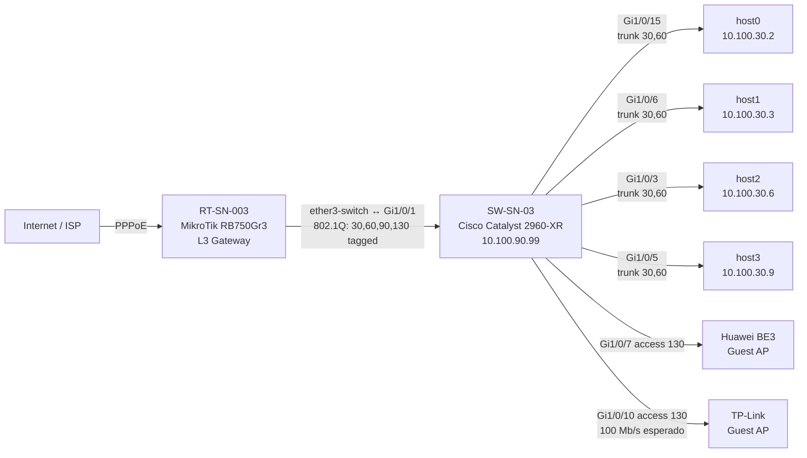
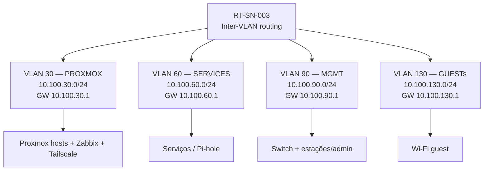
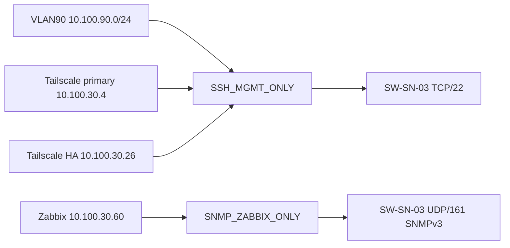

# Network Baseline & Standardization — Homelab Services.NET

**Data do baseline:** 15/09/2026  
**Escopo:** Cisco `SW-SN-03`, MikroTik `RT-SN-003`, VLANs, trunks, management plane, monitoramento e pontos de padronização.  
**Classificação:** documentação técnica sanitizada — não contém senhas, hashes, community SNMP ou credenciais PPPoE.

> Este documento representa o estado validado após a padronização executada em 15/09/2026. Para alterações, usar mudança pequena, backup e rollback (Cisco: `reload in`; RouterOS: Safe Mode).

## 1. Resumo executivo

- Gateway/L3: `RT-SN-003` — MikroTik RB750Gr3, RouterOS 6.49.18 long-term.
- Core L2: `SW-SN-03` — Cisco Catalyst 2960-XR 24P, IOS 15.2(7)E14.
- VLANs funcionais: 30 (PROXMOX), 60 (SERVICES), 90 (MGMT) e 130 (GUESTs).
- VLAN 999 é usada como native/blackhole no Cisco; não carrega tráfego funcional.
- Proxmox trunks padronizados: VLANs 30/60 tagged, native 999.
- Uplink RB↔Cisco: VLANs 30/60/90/130 tagged; RB em tagged-only.
- Cisco: SSHv2 + ACL, secrets type 9, SNMPv3 authPriv, LLDP, NTP/DNS internos/externos validados e HTTP/HTTPS/Telnet/CDP desabilitados.
- STP: Cisco PVST root das VLANs ativas; RB `protocol-mode=none`. O enlace entre ambos é uma fronteira STP e não deve receber segundo enlace L2 sem redesign (preferencialmente MSTP).
- A RB ainda possui pendências importantes de firewall, DHCP e management plane antes de ser considerada totalmente endurecida.

## 2. Topologia física atual

## 3. Topologia lógica / VLANs

### VLAN matrix

| VLAN | Cisco | RouterOS | Rede | Gateway | Função |
|---:|---|---|---|---|---|
| 30 | PROXMOX | vlan30-proxmox-hosts | 10.100.30.0/24 | 10.100.30.1 | Hosts Proxmox / infraestrutura |
| 60 | SERVICES | vlan60-services | 10.100.60.0/24 | 10.100.60.1 | Serviços e workloads |
| 90 | MGMT | vlan90-MGMT | 10.100.90.0/24 | 10.100.90.1 | Gerenciamento |
| 130 | GUESTs | vlan130-guest_wifi | 10.100.130.0/24 | 10.100.130.1 | Wi-Fi guest |
| 999 | BLACKHOLE | — | sem SVI/L3 | — | Native/blackhole no Cisco; não transportada funcionalmente |

## 4. Cisco SW-SN-03 — baseline

| Item | Estado |
|---|---|
| Modelo | WS-C2960XR-24PS-I |
| Serial | FDO2213B011 |
| IOS | 15.2(7)E14 |
| Management | 10.100.90.99/24 via Vlan90 |
| Gateway | 10.100.90.1 |
| VTP | transparent |
| STP | PVST; prioridade 24576 nas VLANs 30/60/90/130 |
| CDP / LLDP | CDP off / LLDP on |
| HTTP/HTTPS | off |
| SSH | v2; login local; ACL SSH_MGMT_ONLY; proteção de tentativas |
| Credencial local | type 9 / scrypt (valor redigido) |
| SNMP | v3 authPriv; view read-only; ACL somente Zabbix |
| DNS | Pi-hole 10.100.60.71 / 10.100.60.72 |
| NTP | a.ntp.br prefer + b.ntp.br + c.ntp.br; sincronizado |
| Timezone | AMT UTC-4 |
| Logging | buffer 32768 informational; console warnings; sequence + ms + timezone |

### 4.1 Portas

| Porta | Descrição | Admin | Modo | Access | Allowed | Native | PortFast | BPDU Guard | PoE |
|---|---|---|---|---:|---|---:|---|---|---|
| Fa0 | — | shutdown | routed | — | — | — | — | — | auto |
| Gi1/0/1 | UPLINK_RT-SN-003 | enabled | trunk | — | 30,60,90,130 | 999 | edge trunk | — | auto |
| Gi1/0/2 | RESERVED_MGMT_EMERGENCY | shutdown | access | 90 | — | — | edge | enable | auto |
| Gi1/0/3 | PROXMOX_HOST2 | enabled | trunk | 999 | 30,60 | 999 | edge trunk | — | auto |
| Gi1/0/4 | RESERVED_PROXMOX | shutdown | trunk | 999 | 30,60 | 999 | edge trunk | — | auto |
| Gi1/0/5 | PROXMOX_HOST3 | enabled | trunk | 999 | 30,60 | 999 | edge trunk | — | auto |
| Gi1/0/6 | PROXMOX_HOST1 | enabled | trunk | 999 | 30,60 | 999 | edge trunk | — | auto |
| Gi1/0/7 | AP_GUEST_01_HUAWEI-BE3 | enabled | access | 130 | — | — | edge | — | auto |
| Gi1/0/8 | RESERVED_AP_GUEST | shutdown | access | 130 | — | — | edge | enable | auto |
| Gi1/0/9 | RESERVED_AP_GUEST | shutdown | access | 130 | — | — | edge | enable | auto |
| Gi1/0/10 | AP_GUEST_02_TPLink | enabled | access | 130 | — | — | edge | — | auto |
| Gi1/0/11 | UNUSED_BLACKHOLE | shutdown | access | 999 | — | — | edge | enable | off |
| Gi1/0/12 | UNUSED_BLACKHOLE | shutdown | access | 999 | — | — | edge | enable | off |
| Gi1/0/13 | RESERVED_PROXMOX | shutdown | trunk | 999 | 30,60 | 999 | edge trunk | — | auto |
| Gi1/0/14 | RESERVED_PROXMOX | shutdown | trunk | 999 | 30,60 | 999 | edge trunk | — | auto |
| Gi1/0/15 | PROXMOX_HOST0 | enabled | trunk | 999 | 30,60 | 999 | edge trunk | — | auto |
| Gi1/0/16 | UNUSED_BLACKHOLE | shutdown | access | 999 | — | — | edge | enable | off |
| Gi1/0/17 | UNUSED_BLACKHOLE | shutdown | access | 999 | — | — | edge | enable | off |
| Gi1/0/18 | UNUSED_BLACKHOLE | shutdown | access | 999 | — | — | edge | enable | off |
| Gi1/0/19 | UNUSED_BLACKHOLE | shutdown | access | 999 | — | — | edge | enable | off |
| Gi1/0/20 | UNUSED_BLACKHOLE | shutdown | access | 999 | — | — | edge | enable | off |
| Gi1/0/21 | UNUSED_BLACKHOLE | shutdown | access | 999 | — | — | edge | enable | off |
| Gi1/0/22 | UNUSED_BLACKHOLE | shutdown | access | 999 | — | — | edge | enable | off |
| Gi1/0/23 | UNUSED_BLACKHOLE | shutdown | access | 999 | — | — | edge | enable | off |
| Gi1/0/24 | UNUSED_BLACKHOLE | shutdown | access | 999 | — | — | edge | enable | off |
| Gi1/0/25 | UNUSED_SFP | shutdown | access | 999 | — | — | — | — | auto |
| Gi1/0/26 | UNUSED_SFP | shutdown | access | 999 | — | — | — | — | auto |
| Gi1/0/27 | UNUSED_SFP | shutdown | access | 999 | — | — | — | — | auto |
| Gi1/0/28 | UNUSED_SFP | shutdown | access | 999 | — | — | — | — | auto |

### 4.2 Management plane

## 5. MikroTik RT-SN-003 — baseline

| Item | Estado |
|---|---|
| Modelo | RB750Gr3 / hEX |
| Serial | HHK0A0BXD64 |
| RouterOS | 6.49.18 long-term |
| WAN | PPPoE em ether1-Link-WaveMax; credencial redigida |
| Bridge | bridge-core, vlan-filtering=yes, tagged-only, pvid=999, protocol-mode=none |
| Uplink Cisco | ether3-switch tagged-only, pvid=999 |
| Emergency/MGMT access | ether2-PC_DN-06 access VLAN90, atualmente inativo no baseline observado |
| L3 | Gateways .1 para VLANs 30/60/90/130 |
| NAT Internet | masquerade via PPPoE |
| DNS guest | redirecionamento TCP/UDP 53 da VLAN130 para Pi-hole primário |
| Management L2 | MAC server / MAC Winbox limitados à lista `interfaces-secure` |
| Timezone | America/Cuiaba |
| NTP client | desabilitado no baseline |
| SNMP | habilitado; community/credenciais redigidas; requer revisão/migração v3 |

### 5.1 Bridge/VLAN

| VLAN | Tagged | Untagged |
|---:|---|---|
| 30 | bridge-core, ether3-switch | — |
| 60 | bridge-core, ether3-switch | — |
| 90 | bridge-core, ether3-switch | ether2-PC_DN-06 |
| 130 | bridge-core, ether3-switch | — |

### 5.2 DHCP/DNS observado

| VLAN | DHCP server | Pool ativo | DNS entregue |
|---:|---|---|---|
| 30 | dhcp_proxmox | 10.100.30.2–10.100.30.254 | 1.1.1.1, 8.8.8.8 |
| 60 | dhcp_services | 10.100.60.2–10.100.60.254 | 1.1.1.1, 8.8.8.8 |
| 90 | dhcp_gerencia | 10.100.90.2–10.100.90.254 | 1.1.1.1, 8.8.8.8 |
| 130 | dhcp_guest | 10.100.130.2–10.100.130.254 | 10.100.60.71, 10.100.60.72 |

> **Atenção:** as faixas atuais 30/60/90 incluem vários endereços usados estaticamente pela própria infraestrutura. Esta é uma das prioridades de correção.

## 6. Mudanças já concluídas

- **Cisco IOS atualizado:** 15.2(7)E14; SSH moderno voltou a operar sem necessidade do legado previamente observado.
- **Trunks Proxmox padronizados:** Gi1/0/3, 5, 6 e 15 permitem apenas VLANs 30/60, native 999 e PortFast edge trunk.
- **Gerência PVE tagged:** Hosts migrados para gerenciamento tagged na VLAN 30; native VLAN 30/1 deixou de ser necessária.
- **Uplink RB↔Cisco padronizado:** Gi1/0/1 transporta 30/60/90/130; native 999 no Cisco e bridge/ether3 tagged-only na RB.
- **VLANs legadas removidas:** VLANs 10, 20 e 369 não existem mais no banco ativo do switch.
- **VLAN 1 sem função operacional:** SVI Vlan1 sem IP e shutdown; nenhuma porta operacional documentada usa VLAN 1.
- **LLDP/CDP:** LLDP habilitado; CDP desabilitado.
- **Web management:** HTTP/HTTPS desabilitados no Cisco.
- **SSH hardening:** SSH v2, login local, type 9/scrypt, bloqueio de tentativas e ACL SSH_MGMT_ONLY.
- **SNMP Cisco:** SNMPv3 authPriv validado no Zabbix; v1/v2c removidos.
- **NTP/DNS Cisco:** DNS pelos Pi-hole e NTP.br redundante; relógio sincronizado em AMT.
- **Logging Cisco:** Sequence numbers, timestamp AMT com ms e buffer informacional de 32 KiB.
- **STP boundary:** Cisco mantém PVST e é root das VLANs ativas; bridge-core da RB opera protocol-mode=none por não haver domínio STP interoperável/redundante.
- **Link host0:** Após troca de cabo, Gi1/0/15 voltou a 1 Gb/s.
