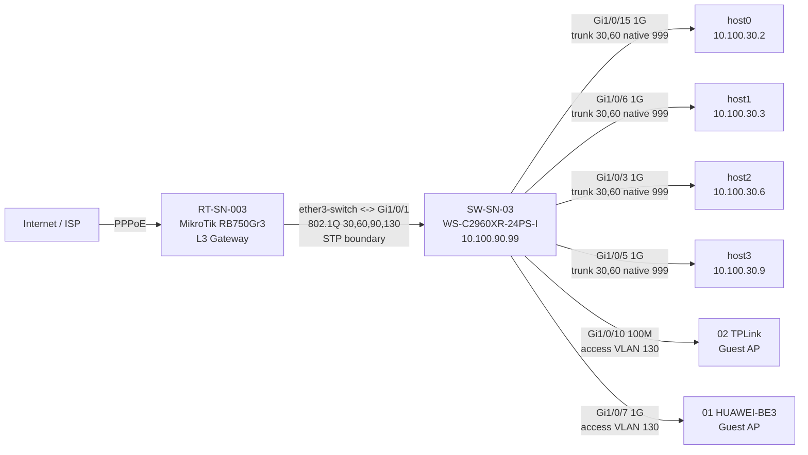
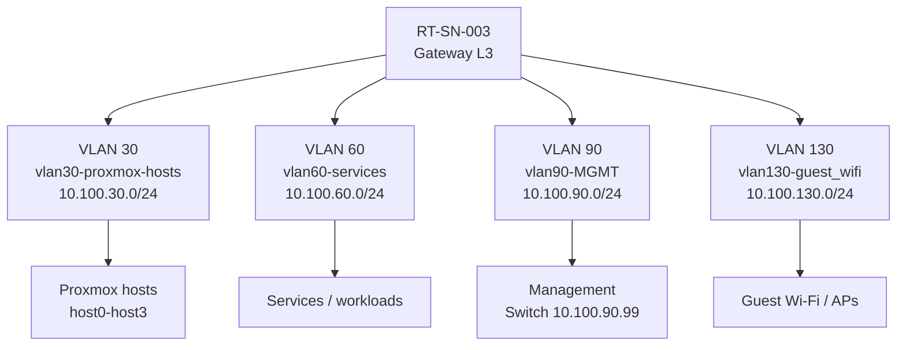
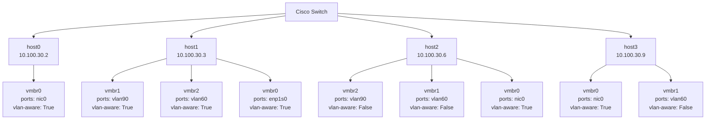

# Current Network Topology

Baseline real de 15/09/2026. Mermaid usa apenas sintaxe suportada pelo GitHub.

## 1. Physical Topology

## 2. VLAN / L3 Topology

## 3. Proxmox Bridges

## 4. Workloads

```mermaid
flowchart TB
  CL["Proxmox Workloads"]
  CL --> N_host0["host0"]
  CL --> N_host1["host1"]
  CL --> N_host2["host2"]
  CL --> N_host3["host3"]
  N_host1 --> W_100_Ubuntu_Server_vmbr0["VM 100 - Ubuntu-Server\nvmbr0 / VLAN Nao determinado\nIP Nao determinado"]
  N_host1 --> W_101_Mine_Server_vmbr0["CT 101 - Mine-Server\nvmbr0 / VLAN Nao determinado\nIP 10.100.20.10/24"]
  N_host1 --> W_102_Nextcloud_vmbr0["VM 102 - Nextcloud\nvmbr0 / VLAN Nao determinado\nIP Nao determinado"]
  N_host1 --> W_102_Nextcloud_vmbr2["VM 102 - Nextcloud\nvmbr2 / VLAN 60 via bridge\nIP Nao determinado"]
  N_host1 --> W_103_tailscale_vpn_vmbr0["VM 103 - tailscale-vpn\nvmbr0 / VLAN Nao determinado\nIP Nao determinado"]
  N_host1 --> W_103_tailscale_vpn_vmbr2["VM 103 - tailscale-vpn\nvmbr2 / VLAN 60 via bridge\nIP Nao determinado"]
  N_host1 --> W_104_Page_ServicesNET_vmbr0["CT 104 - Page-ServicesNET\nvmbr0 / VLAN 30 (inferido pelo IP)\nIP 10.100.30.12/24"]
  N_host1 --> W_106_Interface_Web_vmbr2["CT 106 - Interface-Web\nvmbr2 / VLAN 60 via bridge\nIP 10.100.60.16/24"]
  N_host1 --> W_107_CT107_vmbr2["CT 107 - CT107\nvmbr2 / VLAN 60 via bridge\nIP 10.100.60.71/24"]
  N_host1 --> W_109_Zabbix_server_vmbr0["CT 109 - Zabbix-server\nvmbr0 / VLAN 30 (inferido pelo IP)\nIP 10.100.30.60/24"]
  N_host2 --> W_105_LAB_REDES_vmbr1["VM 105 - LAB-REDES\nvmbr1 / VLAN 60 via bridge\nIP Nao determinado"]
  N_host2 --> W_108_PiHole_2_vmbr1["CT 108 - PiHole-2\nvmbr1 / VLAN 60 via bridge\nIP 10.100.60.72/24"]
  N_host2 --> W_110_bot_server_vmbr1["CT 110 - bot-server\nvmbr1 / VLAN 60 via bridge\nIP 10.100.60.20/24"]
  N_host2 --> W_111_Pag_darling_vmbr1["CT 111 - Pag-darling\nvmbr1 / VLAN 60 via bridge\nIP 10.100.60.80/24"]
  N_host3 --> W_112_streaming_vmbr0["VM 112 - streaming\nvmbr0 / VLAN 60\nIP Nao determinado"]
```

## 5. STP Boundary

O Cisco opera PVST e e root das VLANs 30/60/90/130. A bridge-core da RB opera `protocol-mode=none`; portanto o link RB-Cisco e uma fronteira STP. Nao adicionar segundo enlace L2 sem redesign/MSTP.
